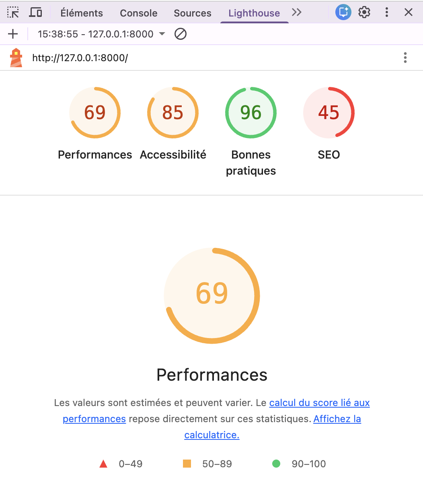
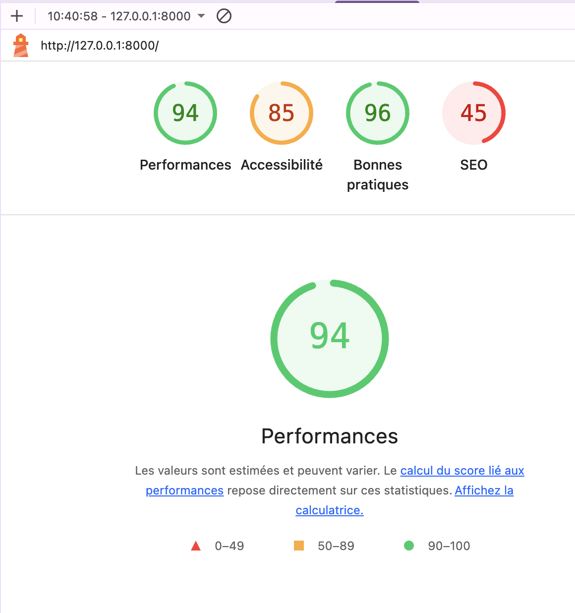

# Handover Technical Documentation

This document complements the README and is intended to help the next developer understand the project structure, technical choices, performance report and main maintenance points.

## Table of Contents

- [Application Architecture](#1-application-architecture)
- [Main Entities](#2-main-entities)
- [Main Technical Choices](#3-main-technical-choices)
- [Security and Access Control](#4-security-and-access-control)
- [Performance Report](#5-performance-report)
- [Testing Strategy](#6-testing-strategy)
- [Continuous Integration](#7-continuous-integration)
- [Possible Improvements](#8-possible-improvements)
- [Handover Notes](#9-handover-notes)

## 1. Application Architecture

The project follows the standard Symfony application structure.

```text
876-P15-inazaoui/
├── config/                # Symfony configuration files
├── migrations/            # Doctrine migration files
├── public/                # Public entry point of the application
│   ├── images/            # Static images
│   ├── uploads/           # Directory for uploaded files
│   └── style.min.css      # Minified stylesheet
├── src/
│   ├── Controller/        # Controllers handling HTTP requests and responses
│   ├── DataFixtures/      # Sample or test data fixtures
│   ├── Entity/            # Doctrine entities representing application data
│   ├── Factory/           # Factories used to generate test data
│   ├── Form/              # Symfony form types
│   ├── Repository/        # Data access layer and custom database queries
│   ├── Security/          # Authentication and authorization components
│   └── Service/           # Reusable business logic services
├── templates/             # Twig templates for the user interface
├── tests/                 # Unit and functional tests
├── .env, .env.local       # Environment configuration files
```

Typical request flow:
Request → Route → Controller → Repository / Service → Entity / Twig Template → Response

## 2. Main Entities

The application is mainly built around 3 entities.

### User

Represents an authenticated user.

Main responsibilities:

- authentication
- role management
- media ownership

Main roles:

- `ROLE_ADMIN`
- `ROLE_GUEST`

### Album

Represents a photography album displayed in the portfolio.

An album can contain several media items.

### Media

Represents an uploaded image or portfolio media item.

A media item is linked to:
- an album
- a user

This allows the application to know:
- which album the media belongs to
- which user uploaded or owns it

## 3. Main Technical Choices

### Migration to Symfony 7.4

The application was migrated from Symfony 5.4 to Symfony 7.4 (LTS) in order to:

- modernize the codebase
- improve maintainability
- benefit from security and framework updates
- reduce technical debt

### Doctrine ORM

Doctrine ORM is used to manage entities and database access in an object-oriented way.  
This makes the application easier to structure and maintain.

### Twig

Twig is used as the templating engine because it provides a clear separation between logic and presentation.
 
### Guest Invitation and Access Workflow

A guest account workflow was implemented to allow the administrator to invite guest photographers from the back office while keeping their permissions restricted.

The process is the following:
1. the administrator creates a guest account in the back office
2. the application sends an invitation email to the guest
3. the guest clicks the link received by email
4. the guest sets a password
5. the guest can then log in and access only their own interface and content

This approach improves collaboration without exposing the full administration area.
If a guest account is blocked or deleted by the administrator, the guest can no longer log in to the application.

### Media Upload Security

Media upload handling was reinforced to improve security and better control uploaded files.

Before the correction, no verification was performed on the uploaded file type or file size when adding a photo.

The upload process was updated to ensure that:
- the uploaded file is a valid image
- the file size does not exceed 2 MB

These checks reduce security risks and help prevent invalid or excessively large files from being stored in the application.

### LiipImagineBundle

LiipImagineBundle was added to optimize images.  
This helps reduce file size, improve page loading time, and deliver a better user experience.

### SensioLabs Minify Bundle

This bundle was used to minify assets and reduce front-end file size.  
The goal was to improve performance and reduce unnecessary payload on page load.

### Zenstruck Foundry, Fixtures, and DAMA Doctrine Test Bundle

These tools were added to improve test setup and reliability:

- **Zenstruck Foundry** for reusable test factories
- **Doctrine Fixtures** for predefined development or test data
- **DAMA Doctrine Test Bundle** for better database test isolation and performance

### PHPUnit, PHPStan, and PHP CS Fixer

These tools were added or reinforced to improve code quality:

- **PHPUnit** ensures that features continue to work correctly
- **PHPStan** detects potential errors through static analysis
- **PHP CS Fixer** enforces consistent coding standards

### Caching and Pagination

Caching and pagination were introduced to improve the performance of pages displaying many media items.

These choices help:
- reduce repeated database work
- improve loading time
- keep pages more efficient and scalable

## 4. Security and Access Control

Security is based on authentication and role-based authorization.

Main rules:

- visitors can only access public pages,
- admins have full access to administration features,
- guests are limited to their own content.

Authentication and authorization were reinforced during the project in order to improve reliability and reduce security risks.

## 5. Performance Report

### Context

Performance slowdowns were observed on the **Guests** page of the application.  
The issue became more noticeable as the number of guest users increased.

A performance analysis was conducted in order to:
- identify the source of the slowdown
- measure the performance of the **Front Office pages**
- compare the performance **before and after the optimization**

### Scope of the Analysis

The following Front Office pages were analyzed:
- Homepage
- Portfolio page
- Guests page
- Guest page

### Tools Used

- **Symfony Profiler**  
  Used to analyze server-side performance indicators such as:
  - total execution time
  - database query time
  - number of executed queries
  - peak memory usage

- **Lighthouse**  
  Used to analyze client-side performance indicators, including:
  - performance score
  - page loading metrics

### Methodology

Each page was tested twice:

1. **Before optimization**
2. **After optimization**

### Identified Issue: N+1 Query Problem

The Symfony Profiler revealed that the slowdown on the **Guests** page was caused by an **N+1 query problem**.

Doctrine executed:

- one initial query to retrieve the main list of guests
- additional queries for each related element (such as associated media)

As the number of guests increased, the number of database queries also increased, which significantly slowed down the page.

### Implemented Solution

To resolve this issue, a **dedicated repository method** was created.

The query was rewritten to include the necessary **joins with media table**. This allows Doctrine to retrieve all required data in a single optimized query rather than triggering multiple additional queries.

This approach significantly reduces the number of database queries executed when loading the page.

### Results

After the optimization:
- the number of database queries decreased
- the total execution time improved
- the performance score is improved

#### Guests page
| Before | After |
|--------|-------|
|  |  |

#### Guest page
| Before | After |
|--------|-------|
|  |  |

#### Homepage
| Before | After |
|--------|-------|
|  |  |

### Conclusion

The performance issue on the **Guests** page was caused by an N+1 query pattern generated by Doctrine when retrieving related data.

By implementing a dedicated repository query with proper joins, the number of queries was reduced and the page performance significantly improved.

This optimization makes the page more scalable as the number of guest users increases.

## 6. Testing Strategy

Test coverage reaches 81.5%, exceeding the required 70%.

The tests mainly focus on:
- controllers
- access control
- front-office pages
- back-office features
- guest-specific actions

Most tests are functional tests, with a few unit tests for services and entities.

See the full report here: [Coverage Report](public/coverage-report.html)

## 7. Continuous Integration

A GitHub Actions pipeline was added to automate quality checks.

The purpose is to help ensure that new changes do not introduce regressions.

Automated checks in this project include:
- install dependencies
- run tests
- run code quality checks

## 8. Possible Improvements

Possible future improvements include:
- improving responsive design
- enhancing the back-office (for example editing an existing media)
- use a framework front such as React or Vue
- extending automated test coverage
- improving the front-end design and user experience

## 9. Handover Notes

Recommended first steps for a new developer:
- read the README
- review the main entities
- inspect the controllers managing albums, media, and guests
- run the test suite locally
- review the performance and coverage reports in `public/coverage-report.html`
